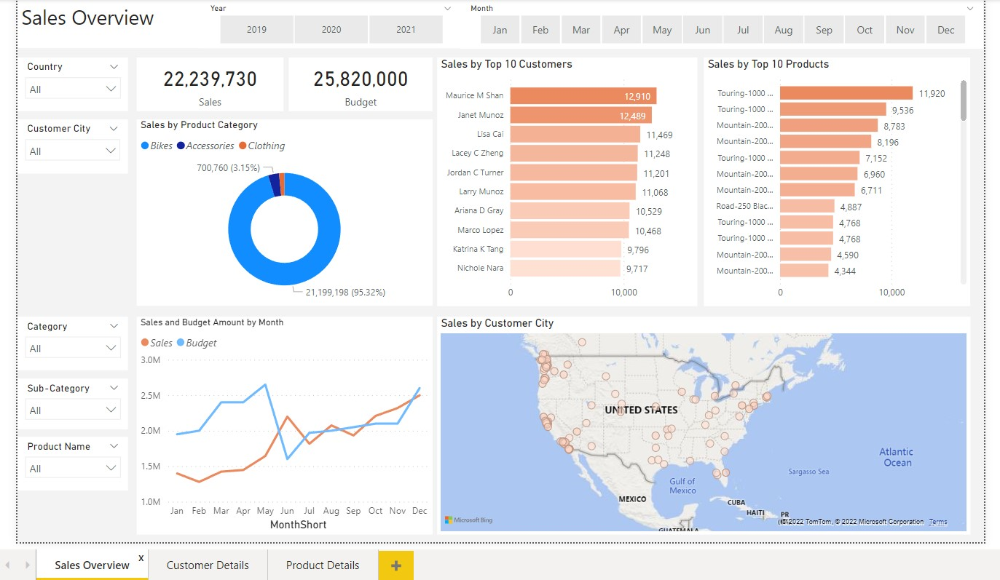
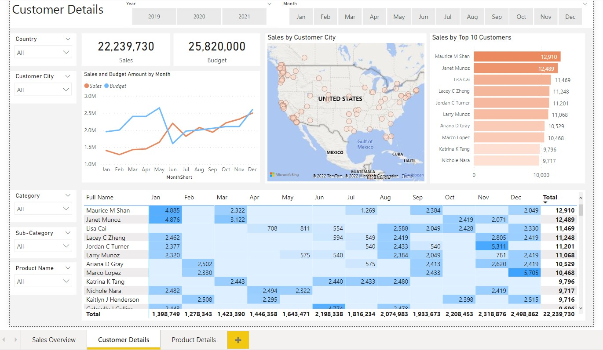

# Sales Dashboard for Sports & Outdoor Goods Retailer

This project is namely used to display competency in using Power BI. Sales data is obtained from a fictional sports & outdoor goods retailer. The data available is from January 2019 - January 2021. 

SQL Server was used for data processing before importing to Power BI to create the sales dashboard. The dashboard is split across 3 pages (Sales Overview, Customer Details, Product Details). 

## Dataset Used

The following tables will be used: 

| Table Name | Type | Description |
| --- | --- | --- |
| 1. DIM_Calendar | Microsoft Excel CSV | Datekey, Date, Day, WeekNr, Month, Quarter, Year |
| 2. DIM_Customer | Microsoft Excel CSV | Table of customers by Name, Gender, Country, City, State  |
| 3. DIM_Products | Microsoft Excel CSV | Table of products by ProductKey, ProductItemCode, ProductName, Subcategory, ProductCategory, ModelName, Production Description |
| 4. FACT_Budget | Microsoft Excel CSV | Table of monthly budget. Date, Budget |
| 5. FACT_InternalSales | Microsoft Excel CSV | Table of product sales by ProductKey, OrderDate, DueDateKey, ShipDateKey, CustomerKey, SalesOrderNum, SalesAmount, OrderDate |

## Viewing the Dashboard

It is recommended to download the .pbix to view and interact with the dashboard. However, for easy viewing, images of the dashboards are available below. 

### Acknowledgments

This portfolio was created as part of [Ali Ahmad's](https://www.youtube.com/watch?v=z7o5Wju-PZg&list=PLMfXakCUhXsEUtk8c0zWr4whamGxLhAu0)
6-part series on how to create a data analyst portfolio project. 
